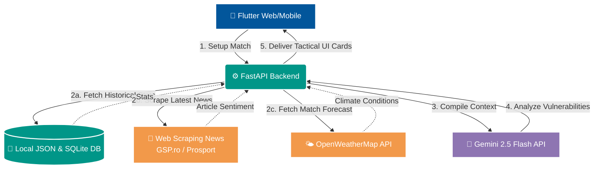

# ⚽ Forma OS

> **The ultimate AI-driven tactical operating system for modern football coaches.**

[](#)
[](#)
[](#)
[](#)

---

## 📖 Table of Contents
- [Vision & Problem](#-vision--problem)
- [System Architecture](#-system-architecture)
- [Core Modules & Features](#-core-modules--features)
- [Tech Stack](#-tech-stack)
- [Installation & Setup](#-installation--setup)
- [Repository Structure](#-repository-structure)
- [Context & Team](#-context--team)

---

## 👁️ Vision & Problem

Traditional video analysis shows us *what happened*, but it struggles to predict **when and how it will repeat**. 

**Forma OS** brings a radical paradigm shift: an elite, AI-driven predictive intelligence platform designed exclusively for meticulous **opponent analysis**. By fusing real-time open-source intelligence (OSINT), historical match statistics, and advanced climate profiling, Forma OS uncovers hidden patterns, chronic vulnerabilities, and the exact moments an opponent will crack under pressure.

---

## ⚙️ System Architecture

Forma OS operates as a highly automated intelligence pipeline that triggers as soon as the coaching staff begins their preparation. Below is the data flow:



1. **Trigger Phase:** The coach selects an upcoming opponent, stadium, and match date/time in the **Match Setup** screen.
2. **Context Gathering:** The backend reaches out to the **OpenWeatherMap API** for the match forecast, **scrapes the latest sports news** (via `BeautifulSoup` on GSP.ro/Prosport.ro) to capture team morale and injuries, and pulls historical match stats from the local cache.
3. **AI Synthesis:** This rich context is fed to the **Gemini 2.5 Flash API**, which evaluates structural team flaws and individual vulnerabilities.
4. **Tactical Deployment:** Insights are seamlessly delivered to the Flutter frontend, mapping weaknesses and preparing the **Omniscient AI Assistant**.

---

## 🧩 Core Modules & Features

Forma OS is divided into three primary tactical modules, reflecting the workflow of a modern coaching staff:

### 1. Match Setup
The foundation of the tactical plan. Configure the upcoming opponent, the stadium, and the match date/time. 
- **Automated Intelligence:** Saving the setup automatically fetches live weather forecasts and triggers the background AI pipeline to aggressively scrape and analyze the opponent.

### 2. Intelligence Hub (Pregame)
The ultimate pregame scouting tool, divided into actionable intelligence:
- **📰 News Scraping & Sentiment:** Actively scrapes major Romanian sports outlets (GSP.ro, Prosport.ro) to gauge player morale, injury updates, and public pressure before the match.
- **⚡ Chronic Gaps:** Gemini-powered detection of team-level tactical vulnerabilities (e.g., exposed flanks, slow defensive transitions). These gaps are dynamically mapped with spatial coordinates onto an interactive Flutter tactical pitch.
- **🛡️ Opponent Weakness Profiling:** Individual player scouting reports generated by combining historical stats, scraped news sentiment, and our unique **Climate Risk Engine**. The engine assesses fatigue and vulnerability by comparing a player's birth country climate against the forecasted match-day weather.

### 3. Tactical Board (In-game & Halftime)
Real-time adjustments to win the match while it's happening:
- **📊 Live Monitoring:** Real-time player fatigue tracking (simulated biometrics) and live tactical gap detection.
- **🔄 Halftime Adjustments:** Predictive halftime substitution suggestions based on the flow of the game.
- **🤖 Omniscient AI Assistant:** A conversational AI agent with full RAG (Retrieval-Augmented Generation) context of the weather, player stats, scraped news, and live fatigue. Ask it anything, and it will respond with precise tactical advice.

---

## 🛠️ Tech Stack

| Layer | Technologies | Description |
| :--- | :--- | :--- |
| **Frontend** | Flutter Web/Mobile | Premium, glassmorphism-based dark theme UI designed for interactive dashboarding. |
| **Backend** | Python, FastAPI, SQLite | High-performance backend using local JSON datasets (`Date - meciuri`) for speed. |
| **AI / LLM** | Google Gemini API | `gemini-2.5-flash` for NLP synthesis, intelligence extraction, and the tactical assistant. |
| **Data Gathering** | BeautifulSoup, OpenWeatherMap | Real-time web scraping of sports media and live match-day weather integration. |

---

## 🚀 Installation & Setup

### 1. Backend (Python + FastAPI)
The core backend runs out of the `cloud_run` directory.

1. Navigate to the backend directory and install dependencies:
   ```bash
   cd cloud_run
   pip install -r requirements.txt
   ```
2. Set up your environment variables. Ensure your `.env` file contains:
   ```env
   GOOGLE_API_KEY=your_gemini_key_here
   OPENWEATHER_API_KEY=your_weather_key_here
   ```
3. Start the server using Uvicorn:
   ```bash
   uvicorn main:app --host 0.0.0.0 --port 8000 --reload
   ```

### 2. Frontend (Flutter)
The UI is located in the `flutter_app` directory.

1. Ensure you have the Flutter SDK installed and configured for web/desktop.
2. Download and compile the packages:
   ```bash
   cd flutter_app
   flutter pub get
   ```
3. Run the web application:
   ```bash
   flutter run -d chrome
   ```

---

## 🧹 Repository Structure

The core architecture relies strictly on two directories:
- `/cloud_run`: The Python FastAPI backend.
- `/flutter_app`: The Flutter frontend.

> **Cleanup Notice:** Legacy folders from previous iterations (e.g., `terraform`, `dataflow`, `data_pipeline`, `data_factory`, `edge_ml`, and files like `firestore.rules`) are deprecated and should be safely deleted to maintain a clean repository.

---

## 🎓 Context & Team

Acest proiect a fost dezvoltat cu pasiune și dedicare în cadrul evenimentului oficial:
**"U" Hack! Code in Black & White** (24-26 Aprilie 2026, Cluj-Napoca).

*Suntem U. Dincolo de linii.* ⚽🤍🖤
